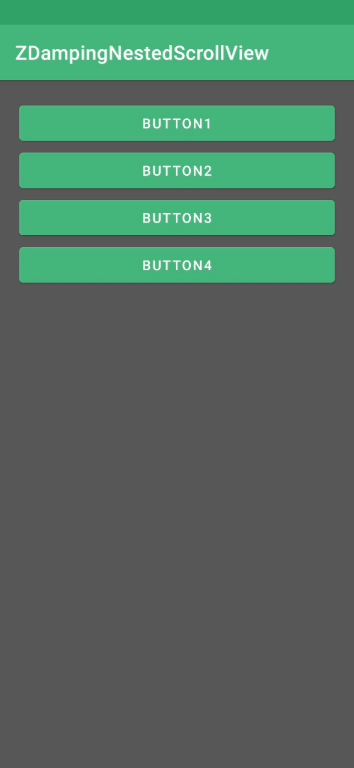
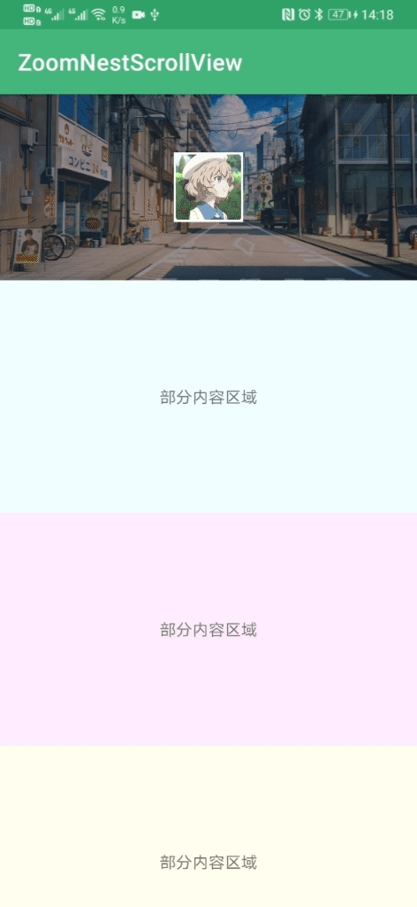

## 简介

定义保存 APP 常见的 View 效果

## 效果预览

|1、阻尼效果View | 2、下拉放大View|
|:---:|:---:|
|||

## 使用

#### [1、阻尼效果View](https://github.com/humoo/WidgetSample/blob/master/zhxumao-widget/src/main/java/com/zhxumao/widget/ZDampingNestedScrollView.java)

在 layout 中，将 `ZDampingNestedScrollView` 设置为根布局即可。

使用时注意 `ZDampingNestedScrollView` 继承自 `NestedScrollView` ，布局中仅支持一个子View布局

示例： [act_zdamping_nest_scroll_view.xml](https://github.com/humoo/WidgetSample/blob/master/app/src/main/res/layout/act_zdamping_nest_scroll_view.xml)

```
<?xml version="1.0" encoding="utf-8"?>
<com.zhxumao.widget.ZDampingNestedScrollView xmlns:android="http://schemas.android.com/apk/res/android"
    android:layout_width="match_parent"
    android:layout_height="match_parent"
    android:orientation="vertical">

    <LinearLayout
        android:layout_width="match_parent"
        android:layout_height="match_parent"
        android:orientation="vertical">

        //你的代码
        
    </LinearLayout>

</com.zhxumao.widget.ZDampingNestedScrollView>
```
#### [2、下拉放大View](https://github.com/humoo/WidgetSample/blob/master/zhxumao-widget/src/main/java/com/zhxumao/widget/ZoomNestScrollView.java)

① 在 layout 中，将 ZoomNestScrollView 设置为根布局。

② 自己写好需要放大的 view ，设置属性 `android:tag="zoom_bg"` 即可。

示例： [act_zoom_view.xml](https://github.com/humoo/WidgetSample/blob/master/app/src/main/res/layout/act_zoom_view.xml)

```
<?xml version="1.0" encoding="utf-8"?>
<com.zhxumao.widget.ZoomNestScrollView xmlns:android="http://schemas.android.com/apk/res/android"
    xmlns:app="http://schemas.android.com/apk/res-auto"
    android:layout_width="match_parent"
    android:layout_height="match_parent">

    <LinearLayout
        android:layout_width="match_parent"
        android:layout_height="match_parent"
        android:orientation="vertical">

        <RelativeLayout
            android:layout_width="match_parent"
            android:layout_height="160dp"
            android:tag="zoom_bg">

            <ImageView
                android:layout_width="match_parent"
                android:layout_height="match_parent"
                android:scaleType="centerCrop"
                android:src="@mipmap/bg2" />

        </RelativeLayout>

        
        //你的代码
        
        
    </LinearLayout>

</com.zhxumao.widget.ZoomNestScrollView>
```


